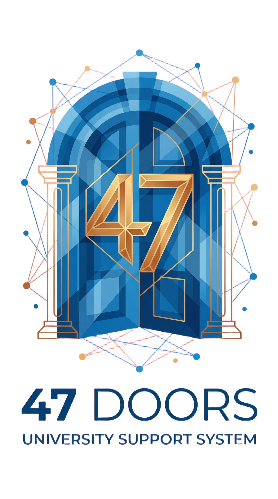
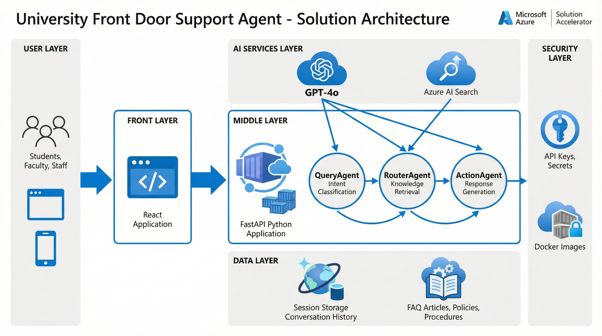
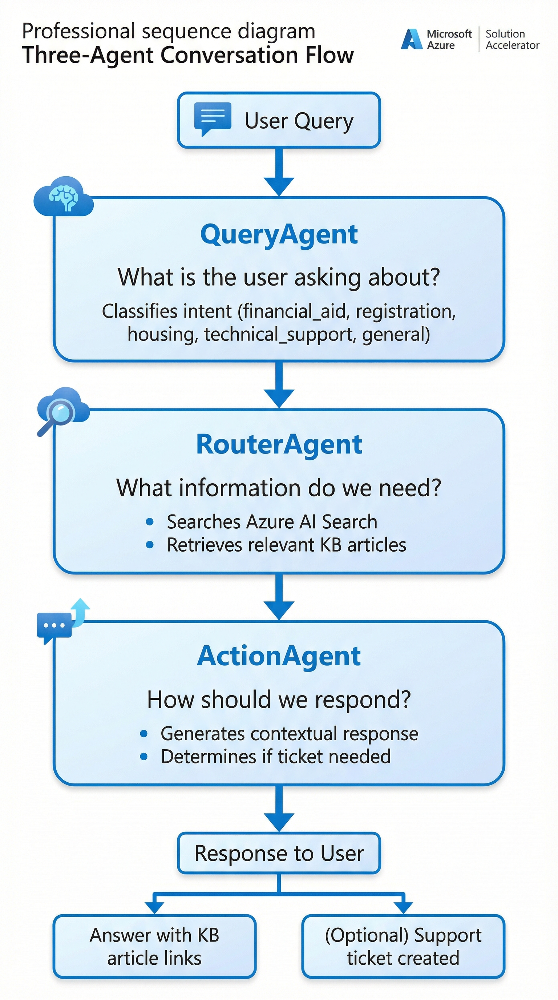
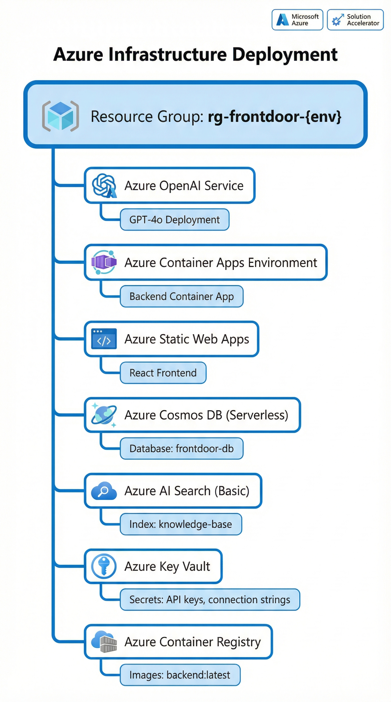
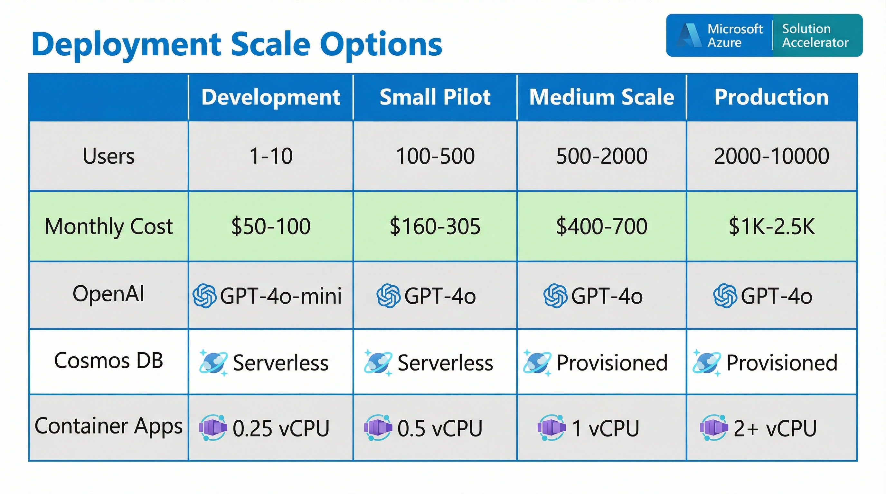

<div align="center">
  
</div>

# 🏆 California Hackathon Accelerator — 47 Doors

[](https://python.org)
[](https://fastapi.tiangolo.com)
[](https://react.dev)
[](https://typescriptlang.org)
[](https://azure.microsoft.com)
[](LICENSE)

> **California Hackathon Accelerator** — A spec-kit-powered starting point for teams building on the 47 Doors three-agent AI system for university student support.

---

## 🏁 Hackathon Quick Start

```bash
# 1. Open in GitHub Codespaces (recommended) or clone locally
# 2. Install dependencies
npm run setup

# 3. Start in mock mode (no Azure credentials needed)
npm start

# 4. Run smoke tests
npm run smoke-test
```

> **Mock mode** lets you develop and demo without Azure credentials. Labs 00–03 work entirely in mock mode.

---

## 📖 Overview

The **Universal Front Door Support Agent** is a three-agent AI system that provides a single, intelligent entry point for all university student support requests. Instead of navigating multiple disconnected support channels, students interact with one interface that:

- 🎯 **Detects intent** from natural language queries
- 🔀 **Routes requests** to the correct department
- 🎫 **Creates tickets** automatically in ServiceNow
- 📚 **Retrieves knowledge** articles for self-service
- 👤 **Escalates to humans** for policy-related requests
- 🎤 **Voice interaction** via Azure OpenAI GPT-4o Realtime API with WebRTC — speak naturally with the same AI pipeline

**🎯 Target Impact**: Increase first-contact resolution from **40%** to **65%**

### 🏗️ Solution Architecture



---

## 🎓 Boot Camp Labs Overview

**Build this entire system in 8 hours using GitHub Codespaces!** This repository includes a complete boot camp curriculum with 8 progressive labs. All labs run in GitHub Codespaces - no local installation required.

| 📋 Lab | 📝 Title                                                         | ⏱️ Duration | 🔨 What You'll Build                                                                         |
| :----: | ---------------------------------------------------------------- | :---------: | -------------------------------------------------------------------------------------------- |
|   00   | [🚀 Environment Setup](./labs/00-setup/)                         |   30 min    | Launch GitHub Codespaces, configure CORS, test the chat interface                            |
|   01   | [🤖 Understanding AI Agents](./labs/01-understanding-agents/)    |   90 min    | Learn multi-agent vs monolithic architectures, build an intent classifier with >90% accuracy |
|   02   | [🔌 Azure MCP Setup](./labs/02-azure-mcp-setup/)                 |   30 min    | Configure Model Context Protocol for Azure OpenAI and AI Search integration                  |
|   03   | [📝 Spec-Driven Development](./labs/03-spec-driven-development/) |   45 min    | Write feature specs and AI constitution before generating code with Claude/Copilot           |
|   04   | [🔍 Build RAG Pipeline](./labs/04-build-rag-pipeline/)           |    2 hrs    | Implement hybrid search (vector + keyword) with Azure AI Search and 54 KB articles           |
|   05   | [🔗 Agent Orchestration](./labs/05-agent-orchestration/)         |    2 hrs    | Wire up QueryAgent → RouterAgent → ActionAgent pipeline with session management              |
|   06   | [🚀 Deploy with azd](./labs/06-deploy-with-azd/)                 |   90 min    | Containerize with Docker, deploy to Azure Container Apps with `azd up`                       |
|   07   | [🔌 MCP Server](./labs/07-mcp-server/)                           |   60 min    | _(Stretch)_ Expose your agent as an MCP server for Claude Desktop integration                |

### 📈 Learning Path

```
┌─────────────┐     ┌─────────────┐     ┌─────────────┐     ┌─────────────┐
│  🚀 Lab 00  │     │  🤖 Lab 01  │     │  🔌 Lab 02  │     │  📝 Lab 03  │
│    Setup    │────▶│   Agents    │────▶│     MCP     │────▶│    Specs    │
│   30 min    │     │   90 min    │     │   30 min    │     │   45 min    │
└─────────────┘     └─────────────┘     └─────────────┘     └─────────────┘
                                                                   │
       ┌───────────────────────────────────────────────────────────┘
       ▼
┌─────────────┐     ┌─────────────┐     ┌─────────────┐     ┌─────────────┐
│  🔍 Lab 04  │     │  🔗 Lab 05  │     │  🚀 Lab 06  │     │  🔌 Lab 07  │
│     RAG     │────▶│  Pipeline   │────▶│   Deploy    │────▶│     MCP     │
│   2 hrs     │     │   2 hrs     │     │   90 min    │     │   60 min    │
└─────────────┘     └─────────────┘     └─────────────┘     └─────────────┘
```

### 🛠️ Key Skills by Lab

| 💡 Skill              | Lab 00 | Lab 01 | Lab 02 | Lab 03 | Lab 04 | Lab 05 | Lab 06 | Lab 07 |
| --------------------- | :----: | :----: | :----: | :----: | :----: | :----: | :----: | :----: |
| 🐍 Python/FastAPI     |        |        |        |        |   ●    |   ●    |   ●    |   ●    |
| 🤖 Azure OpenAI       |        |   ●    |   ●    |        |   ●    |   ●    |        |        |
| 🔍 Azure AI Search    |        |        |   ●    |        |   ●    |   ●    |        |        |
| 💬 Prompt Engineering |        |   ●    |        |   ●    |   ●    |   ●    |        |        |
| 🐳 Docker/Containers  |        |        |        |        |        |        |   ●    |        |
| ☁️ Azure Deployment   |        |        |        |        |        |        |   ●    |        |
| 🔌 MCP Protocol       |        |        |   ●    |        |        |        |        |   ●    |

### ☁️ Azure Service Requirements

Labs 00-03 and 06 can run entirely in **mock mode** without Azure credentials. Labs 04, 05, and 07 require live Azure OpenAI for their core learning objectives.

| 📋 Requirement           | Lab 00 | Lab 01 | Lab 02 | Lab 03 |    Lab 04    |    Lab 05    | Lab 06 |    Lab 07    |
| ------------------------ | :----: | :----: | :----: | :----: | :----------: | :----------: | :----: | :----------: |
| ✅ Mock Mode OK          |   ✓    |   ✓    |   ✓    |   ✓    |              |              |   ✓    |              |
| 🤖 Azure OpenAI (GPT-4o) |        |        |        |        | **Required** | **Required** |        | **Required** |
| 🔍 Azure AI Search       |        |        |        |        | **Required** | **Required** |        |              |

> 💡 **Cost-Saving Tip**: Run Labs 00-03 with `USE_MOCK_MODE=true` to validate your setup before provisioning Azure services. Switch to live Azure OpenAI starting in Lab 04 when you build the RAG pipeline.

📚 **Coach Materials**: [coach-guide/](./coach-guide/) | 📖 **Participant Guide**: [docs/boot-camp/](./docs/boot-camp/)

---

## ⚡ Quick Start

### 📋 Prerequisites

- 🐍 Python 3.11+
- 📦 Node.js 18+
- 🐳 Docker (optional)

### 🌐 Option 1: GitHub Codespaces (Recommended for Quick Testing)

The easiest way to get started is using GitHub Codespaces:

```bash
# 🔧 Backend setup
cd backend
python -m venv .venv
source .venv/bin/activate
pip install -r requirements.txt
cp .env.example .env

# ⚠️ IMPORTANT: Configure CORS for Codespaces
# Edit backend/.env and update CORS_ORIGINS with your Codespaces URLs:
# CORS_ORIGINS=["http://localhost:5173","http://localhost:3000","https://<your-codespace-name>-5173.app.github.dev"]

# 🚀 Start backend (bind to all interfaces for Codespaces)
uvicorn app.main:app --reload --host 0.0.0.0 --port 8000

# 🎨 Frontend setup (new terminal)
cd frontend
npm install
cp .env.example .env

# ⚠️ CRITICAL: Do NOT set VITE_API_BASE_URL in Codespaces!
# Leave it empty so the Vite dev server proxy handles API routing.
# Setting it to http://localhost:8000 will cause ERR_CONNECTION_REFUSED
# because the browser cannot reach localhost inside the container.
# VITE_API_BASE_URL=    <-- must be empty or unset

npm run dev
```

**⚠️ Important Codespaces Configuration:**

1. 🔓 **Make port 8000 public** for external access:

   ```bash
   gh codespace ports visibility 8000:public -c $CODESPACE_NAME
   ```

2. 🔗 **Get your Codespaces URLs** from the Ports tab in VS Code, or construct them:
   - 🎨 Frontend: `https://<codespace-name>-5173.app.github.dev`
   - 🔧 Backend: `https://<codespace-name>-8000.app.github.dev`
   - Your codespace name is in the environment variable `$CODESPACE_NAME`

3. ⚙️ **Update CORS configuration** in [backend/.env](backend/.env):

   ```bash
   CORS_ORIGINS=["http://localhost:5173","http://localhost:3000","https://<your-codespace-name>-5173.app.github.dev"]
   ```

   Note: The backend config uses `validation_alias` to map `CORS_ORIGINS` from .env to the `allowed_origins` setting.

4. 🔄 **Restart the backend** after updating CORS settings to clear the settings cache.

5. ⚠️ **Frontend `.env` — Do NOT set `VITE_API_BASE_URL` to `http://localhost:8000`!**
   In Codespaces, the browser runs outside the container and cannot reach `localhost:8000`.
   Leave `VITE_API_BASE_URL` **empty** so that API calls use relative paths (`/api/...`)
   and are proxied by the Vite dev server to the backend.

   ```bash
   # ✅ Correct (Codespaces)
   VITE_API_BASE_URL=
   # ❌ Wrong (causes ERR_CONNECTION_REFUSED / 502 errors)
   # VITE_API_BASE_URL=http://localhost:8000
   ```

6. 🌐 **IPv4/IPv6 proxy mismatch** — The Vite proxy target in `vite.config.ts` must use
   `http://127.0.0.1:8000` (not `http://localhost:8000`). In some environments, `localhost`
   resolves to IPv6 (`::1`) while uvicorn binds to IPv4 (`0.0.0.0`), causing 500 errors
   from the proxy with an empty response body.

| 🌐 Service      | 🔗 URL                                               |
| --------------- | ---------------------------------------------------- |
| 🎨 Frontend     | `https://<codespace>-5173.app.github.dev`            |
| 🔧 Backend API  | `https://<codespace>-8000.app.github.dev`            |
| 📚 API Docs     | `https://<codespace>-8000.app.github.dev/api/docs`   |
| 💚 Health Check | `https://<codespace>-8000.app.github.dev/api/health` |

### 💻 Option 2: Local Development

```bash
# 📂 Clone repository
git clone https://github.com/msftsean/hiedcab_frontdoor_agent.git
cd hiedcab_frontdoor_agent

# 🔧 Backend setup
cd backend
python -m venv .venv
source .venv/bin/activate  # Windows: .venv\Scripts\activate
pip install -r requirements.txt
cp .env.example .env
uvicorn app.main:app --reload --port 8000

# 🎨 Frontend setup (new terminal)
cd frontend
npm install
cp .env.example .env
npm run dev
```

| 🌐 Service      | 🔗 URL                           |
| --------------- | -------------------------------- |
| 🎨 Frontend     | http://localhost:5173            |
| 🔧 Backend API  | http://localhost:8000            |
| 📚 API Docs     | http://localhost:8000/docs       |
| 💚 Health Check | http://localhost:8000/api/health |

### 🐳 Option 3: Docker Compose

```bash
docker-compose up --build
```

| 🌐 Service  | 🔗 URL                |
| ----------- | --------------------- |
| 🎨 Frontend | http://localhost:3000 |
| 🔧 Backend  | http://localhost:8000 |

---

## 🏗️ Architecture

### 🔄 Three-Agent Conversation Flow



The three-agent system processes each user query through a coordinated pipeline:

1. 🎯 **QueryAgent** - Classifies intent (financial aid, registration, housing, technical support, general)
2. 🔀 **RouterAgent** - Searches Azure AI Search for relevant KB articles
3. ⚡ **ActionAgent** - Generates contextual responses and determines if a support ticket is needed

### ☁️ Azure Infrastructure



| 🔧 Service         | 📝 Purpose                                                       |
| ------------------ | ---------------------------------------------------------------- |
| 🤖 Azure OpenAI    | Intent classification, response generation                       |
| 📦 Container Apps  | Backend API hosting                                              |
| 🌐 Static Web Apps | Frontend hosting (optional in backend-first lab deployment path) |
| 💾 Cosmos DB       | Session and audit storage                                        |
| 🔍 AI Search       | Knowledge base search                                            |
| 🔐 Key Vault       | Secrets management                                               |

---

## ☁️ Azure Deployment

[](https://portal.azure.com/#create/Microsoft.Template/uri/https%3A%2F%2Fraw.githubusercontent.com%2Fmsftsean%2Fhiedcab_frontdoor_agent%2Fmain%2Finfra%2Fazuredeploy.json)

### 🌍 Supported Regions

Deploy to regions with GPT-4o availability:

| 🌐 Region         | 🤖 GPT-4o | 🤖 GPT-4o-mini |
| ----------------- | :-------: | :------------: |
| 🇺🇸 East US        |    ✅     |       ✅       |
| 🇺🇸 East US 2      |    ✅     |       ✅       |
| 🇺🇸 West US 3      |    ✅     |       ✅       |
| 🇬🇧 UK South       |    ✅     |       ✅       |
| 🇸🇪 Sweden Central |    ✅     |       ✅       |

### 🚀 Deploy with Azure Developer CLI

```bash
# 🔐 Login to Azure
azd auth login

# 🏗️ Initialize and deploy
azd init
azd up
```

### 🛠️ Deployment Field Notes (Validated in Codespaces)

- `azd auth login` can be blocked by Conditional Access (`AADSTS53003`) in hosted environments. Use service principal login for non-interactive deployments:

```bash
az login --service-principal \
  -u <AZURE_CLIENT_ID> \
  -p <AZURE_CLIENT_SECRET> \
  --tenant <AZURE_TENANT_ID>

az account set --subscription <AZURE_SUBSCRIPTION_ID>

azd auth login \
  --client-id <AZURE_CLIENT_ID> \
  --client-secret <AZURE_CLIENT_SECRET> \
  --tenant-id <AZURE_TENANT_ID> \
  --no-prompt
```

- If `azd up` fails with provider registration errors, an admin must register providers at subscription scope:

```bash
az provider register -n Microsoft.App --subscription <AZURE_SUBSCRIPTION_ID> --wait
az provider register -n Microsoft.Web --subscription <AZURE_SUBSCRIPTION_ID> --wait
```

- Cosmos DB regional capacity and subscription access vary by region. If deployment fails in one region, set Cosmos to an allowed region (for example `canadacentral`) while keeping app hosting in your preferred region.

### 💰 Cost Estimates



| 📊 Scale       |   👥 Users   | 💵 Monthly Cost |
| -------------- | :----------: | :-------------: |
| 🧪 Development |     1-10     |     $50-100     |
| 🚀 Small Pilot |   100-500    |    $160-305     |
| 📈 Medium      |  500-2,000   |    $400-700     |
| 🏢 Production  | 2,000-10,000 |  $1,000-2,500   |

See [Cost Estimation Guide](./docs/deployment/COST_ESTIMATION.md) for details.

---

## 📡 API Reference

| 🔧 Method | 🔗 Endpoint         | 📝 Description          |
| --------- | ------------------- | ----------------------- |
| `POST`    | `/api/chat`         | 💬 Submit support query |
| `GET`     | `/api/health`       | 💚 Health check         |
| `GET`     | `/api/session/{id}` | 📋 Get session          |
| `DELETE`  | `/api/session/{id}` | 🗑️ End session          |

### 📤 POST /api/chat

**📥 Request:**

```json
{
  "message": "I forgot my password",
  "session_id": null
}
```

**📤 Response:**

```json
{
  "session_id": "550e8400-e29b-41d4-a716-446655440000",
  "ticket_id": "TKT-IT-20260121-0001",
  "department": "IT",
  "status": "created",
  "message": "I've created a ticket for IT Support...",
  "knowledge_articles": [
    {
      "title": "How to Reset Your Password",
      "url": "https://kb.university.edu/password-reset",
      "relevance_score": 0.94
    }
  ],
  "escalated": false,
  "estimated_response_time": "2 hours"
}
```

---

## 🧪 Testing

### � Current Test Status

| Suite | Tests | Status |
|-------|------:|--------|
| Backend (pytest) | 435/435 | ✅ Passing |
| Frontend (vitest) | 8/8 | ✅ Passing |
| Lab 01 – Understanding Agents | 7/7 | ✅ EXEMPLARY |
| Lab 03 – Spec-Driven Dev | 8/8 | ✅ EXEMPLARY |
| Lab 05 – Agent Orchestration | 3/3 | ✅ Passing |
| Lab 07 – MCP Server | 8/8 | ✅ EXEMPLARY |

> Labs 02 and 06 require `az login` for Azure-dependent tests.

### �🔧 Backend

```bash
cd backend
source .venv/bin/activate
pytest                           # 🧪 Run all tests
pytest --cov=app --cov-report=html  # 📊 With coverage
```

### 🎨 Frontend

```bash
cd frontend
npm test          # 🧪 Unit tests
npm run test:e2e  # 🎭 E2E tests
```

---

## 📚 Documentation

| 📄 Document                                                               | 📝 Description             |
| ------------------------------------------------------------------------- | -------------------------- |
| 📋 [Feature Spec](./docs/specs/spec.md)                                   | Detailed requirements      |
| 💾 [Data Model](./docs/specs/data-model.md)                               | Schema definitions         |
| 🗺️ [Implementation Plan](./docs/specs/plan.md)                            | Development roadmap        |
| ⚙️ [Customization Guide](./docs/customization/CUSTOMIZATION.md)           | Hands-on customization lab |
| 📦 [Sample Customizations](./docs/customization/SAMPLE_CUSTOMIZATIONS.md) | Ready-to-use examples      |
| 💰 [Cost Estimation](./docs/deployment/COST_ESTIMATION.md)                | Detailed pricing           |

---

## 📁 Project Structure

```
47doors/
├── 🔧 backend/           # FastAPI Python backend
│   ├── app/
│   │   ├── agents/      # 🤖 QueryAgent, RouterAgent, ActionAgent
│   │   ├── api/         # 📡 REST endpoints
│   │   ├── models/      # 📋 Pydantic schemas
│   │   └── services/    # ☁️ Azure integrations
│   └── tests/
├── 🎨 frontend/          # React TypeScript frontend
│   ├── src/
│   │   ├── components/
│   │   └── services/
│   └── tests/
├── 🎓 labs/              # Boot Camp curriculum (8 labs)
│   ├── 00-setup/
│   ├── 01-understanding-agents/
│   ├── 02-azure-mcp-setup/
│   ├── 03-spec-driven-development/
│   ├── 04-build-rag-pipeline/
│   ├── 05-agent-orchestration/
│   ├── 06-deploy-with-azd/
│   └── 07-mcp-server/
├── 👨‍🏫 coach-guide/       # Facilitation materials
├── 📦 shared/            # Common resources (constitution, schemas)
├── 📚 docs/              # Documentation
│   ├── architecture/    # 🏗️ Diagrams
│   ├── customization/
│   ├── deployment/
│   ├── boot camp/       # 📖 Participant guides
│   └── specs/           # 📋 Feature specifications
├── ☁️ infra/             # Azure Bicep templates
├── 🐳 docker-compose.yml
└── 📄 azure.yaml
```

---

## 🤝 Contributing

1. 🍴 Fork the repository
2. 🌿 Create a feature branch (`git checkout -b feature/amazing-feature`)
3. 💾 Commit your changes (`git commit -m 'Add amazing feature'`)
4. 📤 Push to the branch (`git push origin feature/amazing-feature`)
5. 🔀 Open a Pull Request

---

## 📄 License

This project is licensed under the MIT License - see the [LICENSE](LICENSE) file for details.

---

## 📊 Version Matrix

| 🔧 Component  | 📋 Required Version | ✅ Tested Version |
| ------------- | ------------------- | ----------------- |
| 🐍 Python     | 3.11+               | 3.11.14           |
| ⚡ FastAPI    | 0.100+              | 0.109.0           |
| 📦 Node.js    | 18+                 | 22.x              |
| ⚛️ React      | 18+                 | 18.2.0            |
| 📘 TypeScript | 5.0+                | 5.3.3             |
| 🐳 Docker     | 20.10+              | 24.0.7            |
| ☁️ Azure CLI  | 2.50+               | 2.56.0            |
| 🚀 azd        | 1.5+                | 1.7.0             |

---

<div align="center">

🏗️ Built with Azure AI for Higher Education

📅 Last Updated: 2026-03-01 | 📝 Version: 1.1.0

</div>
